# GitHub Copilot CLI Workshop - Phases Diagram

This diagram visualizes the learning journey through the GitHub Copilot CLI workshop, organized into three main phases.

## Workshop Flow Overview

## Phase Breakdown

### 📘 Phase 1: Foundation (50 minutes)
**Goal:** Get set up and understand the basics

| Module | Topic | Duration | Key Takeaways |
|--------|-------|----------|---------------|
| 01 | Installation | 15 min | Install via npm/Homebrew, authenticate, verify setup |
| 02 | Operating Modes | 20 min | Interactive chat, programmatic mode, /delegate |
| 03 | Session Management | 15 min | Continue, resume, clear sessions, track history |

**Milestone:** You can install Copilot CLI, start sessions, and run basic commands

---

### 🔶 Phase 2: Core Features (70 minutes)
**Goal:** Master the essential features for productive use

| Module | Topic | Duration | Key Takeaways |
|--------|-------|----------|---------------|
| 04 | Custom Instructions | 25 min | AGENTS.md, llm.txt, copilot-instructions.md |
| 05 | Tools & Permissions | 20 min | Built-in tools, allow/deny lists, --yolo mode |
| 06 | MCP Servers | 25 min | Configure remote and local MCP servers |

**Milestone:** You can customize Copilot behavior, control tool usage, and extend with MCPs

---

### 🟢 Phase 3: Advanced Capabilities (115 minutes)
**Goal:** Unlock advanced automation and customization

| Module | Topic | Duration | Key Takeaways |
|--------|-------|----------|---------------|
| 07 | Agent Skills | 20 min | Create and use skills from agentskills.io |
| 08 | Plugins | 15 min | Discover and use plugins from marketplace |
| 09 | Custom Agents | 25 min | Build specialized agents and subagents |
| 10 | Hooks | 20 min | Lifecycle hooks for automation |
| 11 | Context Management | 15 min | /context, /compact, token optimization |
| 12 | Advanced Topics | 20 min | Environment vars, CI/CD integration, tips |

**Milestone:** You can build custom workflows, automate complex tasks, and optimize for production

---

## Learning Path Visualization

## Skill Progression

```mermaid
graph LR
    subgraph Beginner["🎯 Beginner Skills"]
        B1[Install & Setup]
        B2[Basic Commands]
        B3[Session Control]
    end
    
    subgraph Intermediate["⚙️ Intermediate Skills"]
        I1[Custom Instructions]
        I2[Tool Management]
        I3[MCP Integration]
    end
    
    subgraph Advanced["🚀 Advanced Skills"]
        A1[Skills & Plugins]
        A2[Custom Agents]
        A3[Automation]
        A4[Production Use]
    end
    
    Beginner --> Intermediate
    Intermediate --> Advanced
    
    style Beginner fill:#e1f5ff,stroke:#0366d6
    style Intermediate fill:#fff5e1,stroke:#f9826c
    style Advanced fill:#e1ffe1,stroke:#28a745
```

## Time Investment

## Prerequisites Flow

## Module Dependencies

---

## Quick Navigation

- **Phase 1 (Foundation):** [01-Installation](01-installation.md) → [02-Modes](02-modes.md) → [03-Sessions](03-sessions.md)
- **Phase 2 (Core Features):** [04-Instructions](04-instructions.md) → [05-Tools](05-tools.md) → [06-MCPs](06-mcps.md)
- **Phase 3 (Advanced):** [07-Skills](07-skills.md) → [08-Plugins](08-plugins.md) → [09-Custom-Agents](09-custom-agents.md) → [10-Hooks](10-hooks.md) → [11-Context](11-context.md) → [12-Advanced](12-advanced.md)

---

**Total Workshop Duration:** Approximately 4 hours (235 minutes)

*This diagram provides a visual representation of your learning journey through the GitHub Copilot CLI workshop. Follow the phases sequentially for the best learning experience.*
